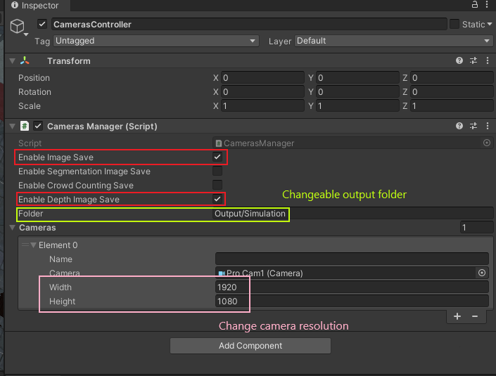

# Depth Estimation in Crowd Simulation (DEiSC)

This is the repo for the Computer Vision course project.

The report of the project can be downloaded [here](./cv_report_caldarella_pedeni_2022.pdf).

Click [here](https://drive.google.com/drive/folders/1QeC6BGdSkCF9nwqj8naZApgODzFVYEKU?usp=sharing) to get the access to the converted and resized dataset.

---

### Authors
- Simone Caldarella (simone.caldarella@studenti.unitn.it)
- Federico Pedeni (federico.pedeni@studenti.unitn.it)
    
### Requirements:
- Monodepth2 library --> clone the library in your project directory with ```git clone https://github.com/nianticlabs/monodepth2.git```
- Numpy --> ```pip install numpy```
- Matplotlib --> ```pip install matplotlib```
- PyTorch --> Check [here](https://pytorch.org/get-started/locally/) the command needed to install the version of pytorch that best suits your pc requirements

### Dataset Structure:
/ConvertedDataset/:
- 1:
  - frame_NUM1.png
  - frame_NUM1_depth.png
  - ...
  - frame_NUMN.png
  - frame_NUMN_depth.png
- 2:
  - frame_NUM1.png
  - frame_NUM1_depth.png
  - ...
  - frame_NUMN.png
  - frame_NUMN_depth.png
- 3
- 4
- 5
- 6
- 7

! The structure is the same in all the numbered directories (each one contains a set of pair of images taken from the same camera)\
!! NUM (NUM1, NUM2, ..., NUMN) is a 4 digit number -- Images from different cameras can have the same NUM in the name
    
### Usage:
0) Download the dataset from the google drive or use your own dataset:
  - if you use your own dataset make sure to have the correct structure
  - if your dataset is not of the correct size 640x192 png/jpg images run the code with the flag ```__CONVERT_MODE__=True```
1) Update all the global variables (path and flag) according to the paths you want to use (free choice)
2) Run the script


### Dataset Generation

For generating the dataset you should use a Unity version compatible with the original CrowdSimulator project, branch `static-simulation` ([here](https://github.com/mmlab-cv/Crowd-Simulator/tree/static-simulation)). The process exploits Unity Editor's GUI, so you will need to open the project in the editor to generate new data.

To record depth maps, select a Camera and add it to the list in the SimController/CamerasController object, under the Cameras Manager script. Then, pick the correct options within the CamerasController object: Enable Image Save (for screenshots) and Enable Depth Save (for depthmaps). This will redirect the cameras' outputs from the Unity internal display to a filestream saving screenshots and depths. 
Resolution of saved samples can be set for each item of the Cameras' list; depthmaps will have the same resolution as frames. 

The output folder can be specified in the CamerasController object, as field of the CamerasManager script. After each run, it will contain a folder for each camera in the Cameras list containing pairs of numbered frames (image_<timestep>.bmp) and their respective depthmaps (image_<timestep>_depth.png). 



To make cameras move along a path, you should first create your path by adding to a general Parent object many invisible GameObjects (such as Cubes) that will be used as nodes for the path; you can also create it by adding only one object and then duplicating and dragging it where you want the next waypoint in the Unity Scene Editor. Then you must add the PathFollower script to your Cameras camera by drag & dropping the script (Assets/DepthEstimationMaterial/PathFollower.cs) as standard Unity component; be sure that Cameras are also added to the list within the CamerasManager script, otherwise no outputs will be saved even though Cameras would move. Red Gizmo lines will show edges between nodes in the Unity Scene Editor, for a clear path visualization. At the beginning of the simulation, Cameras will be automatically translated to the first node of their path and will be rotated to face the next point; then, upon reaching each node they will immediately turn to face the next one. You can set the speed of the camera within a specific field in the PathFollower component in the camera.

**Note**: When planning your walk, make sure that edges do not intersect physical objects. This project does not support automatic obstacle avoidance during camera movement; this is not a relevant issue when colliding with pedestrians, but it could produce unwanted results if buildings or large objects are involved.


Lighting conditions can be changed from the Azure Sky Manager object: they should change independently with time while Cameras follow their paths. It is recommended to use low numbers in the Day Transition field, so that daylight changes noticeably between subsequent frames.

After setting all these features, you just need to start the simulation with the Play button; you can also Pause it with the nearby button, or interrupt it with the same Play button. If you need to rescale the dataset, you can use the companion `convert-dataset.py` script, by setting the final resolution in the `final_size` variable. The script can be called from the root directory specifying the dataset relative path as argument (otherwise it can be hard-coded in the `root_pth` variable).


